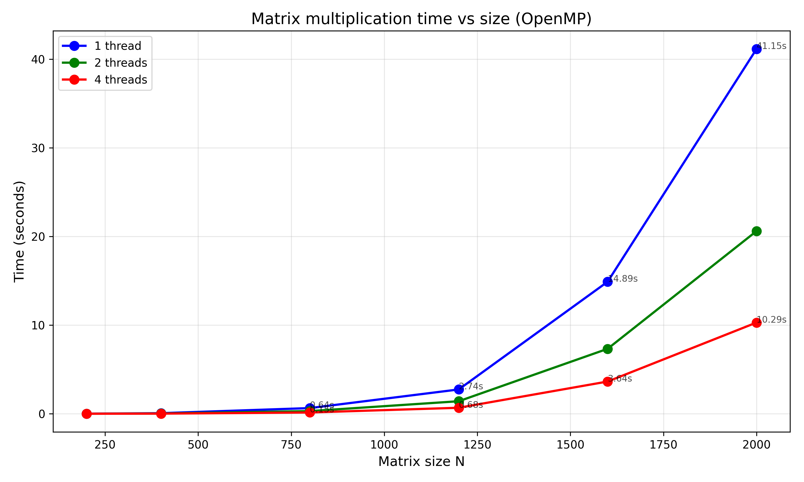

# Лабораторная работа №2
## Параллельное умножение матриц с использованием OpenMP

---

## 1. Цель работы

Модифицировать программу из лабораторной работы №1 для параллельной работы по технологии OpenMP. Провести серию экспериментов с разным количеством потоков (1, 2, 4, 8 и т. д.), разными размерами матриц (200, 400, 800, 1200, 1600, 2000).

---

## 2. Ход работы

В ходе работы код из первой лабораторной работы был адаптирован для работы с OpenMP. Были проведены тесты для различного количества потоков процессора.

**Характеристики оборудования:**
- Процессор: Intel(R) Core(TM) i5-9500 CPU @ 3.00GHz
- Тактовая частота: 3.00 GHz

---

## 3. Результаты тестирования

**Размеры матриц:** 200, 400, 800, 1200, 1600, 2000

### Таблица результатов

| Размер матрицы | 1 поток (с) | 2 потока (с) | 4 потока (с) | Ускорение (4x) |
|----------------|-------------|--------------|--------------|----------------|
| 200 × 200 | 0.0076 | 0.0039 | 0.0049 | 1.55x |
| 400 × 400 | 0.0655 | 0.0326 | 0.0169 | 3.87x |
| 800 × 800 | 0.6411 | 0.3002 | 0.1472 | 4.35x |
| 1200 × 1200 | 2.7441 | 1.4141 | 0.6768 | 4.05x |
| 1600 × 1600 | 14.8942 | 7.3294 | 3.6374 | 4.09x |
| 2000 × 2000 | 41.1478 | 20.6066 | 10.2905 | 4.00x |

### График зависимости времени от размера матрицы

---

## 4. Вывод по тестам

1. **OpenMP работает эффективно** - ускорение достигает 4.35x на 4 потоках

2. **Хорошая масштабируемость** - для матриц от 400×400 и выше ускорение стабильно около 4x

3. **Накладные расходы** заметны только на малых размерах - для 200×200 ускорение всего 1.55x из-за затрат на создание потоков

4. **Задача решена успешно** - программа соответствует требованию лабораторной работы

---

## 5. Итоги

В ходе выполнения лабораторной работы были изучены основы работы с OpenMP. Разработана и протестирована многопоточная программа умножения матриц для различного количества потоков. Полученные результаты подтверждают эффективность параллельных вычислений на больших объемах данных.