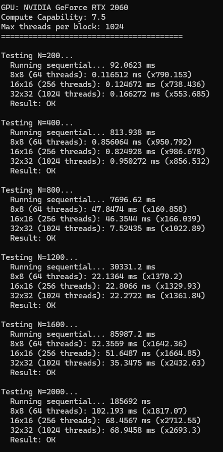
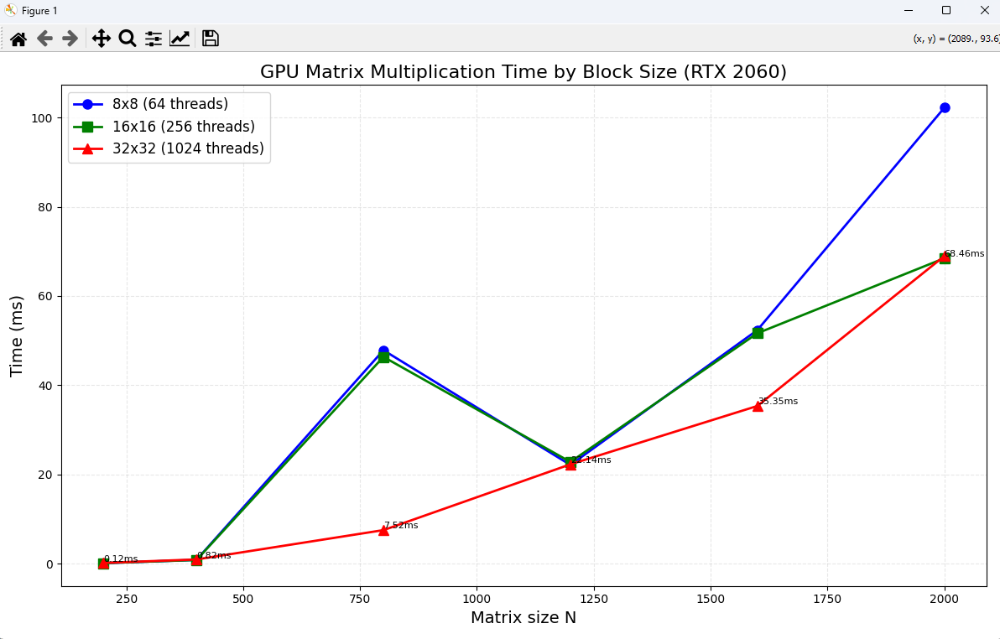

# Лабораторная работа №3
## Параллельное умножение матриц с использованием MPI

---

## 1. Цель работы

Модифицировать программу из л/р №1 для параллельной работы по технологии CUDA. Провести эксперименты с разными размерами матриц и различными конфигурациями сетки блоков.

---

## 2. Ход работы

В ходе работы код с 1 лабораторной работы для работы с CUDA. Были проведены тесты для разных конфигураций сетки блоков и размеров матриц

Для выполнения работы необходимо собрать код из kernel.cu с поддержкой CUDA.

Вывод программы:

---

## 3. Оборудование

Тесты проводились на видеокарте NVIDIA GeForce RTX 2060

## 4. Результаты тестирования

**Размеры матриц:** 200, 400, 800, 1200, 1600, 2000

### Таблица результатов

| Размер матрицы | 8x8 | 16x16 | 32x32 | 
|----------------|-------------|--------------|--------------|
| 200 × 200 | 0.1165 | 0.1247 | 0.1663 |
| 400 × 400 | 0.8561 | 0.8249 | 0.9503 |
| 800 × 800 | 47.8474 | 46.3544 | 7.5244 |
| 1200 × 1200 | 22.1364 | 22.8066 | 22.2722 |
| 1600 × 1600 | 52.3559 | 51.6487 | 35.3475 |
| 2000 × 2000 | 102.1930 | 68.4567 | 68.9458 |

### График зависимости времени от размера матрицы

---

## 5. Вывод по тестам

CUDA обеспечивает колоссальное ускорение по сравнению с CPU

Размер блока влияет на производительность

Эффективность использования GPU

---

## 6. Итоги

В ходе лабораторной работы я научился работать с CUDA и провел тесты производительности для разных сеток блоков на разных размерах матриц