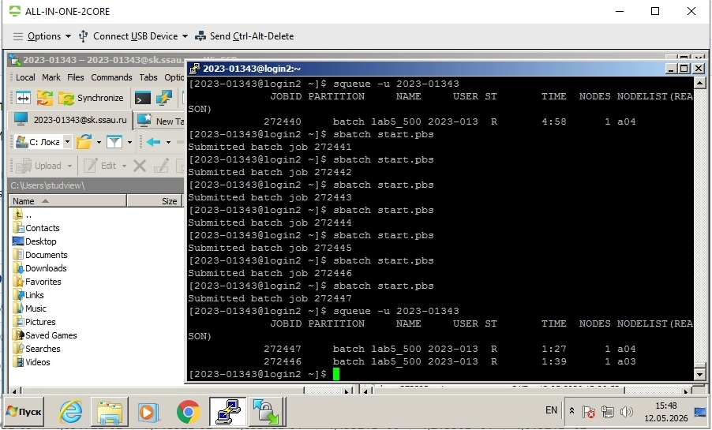
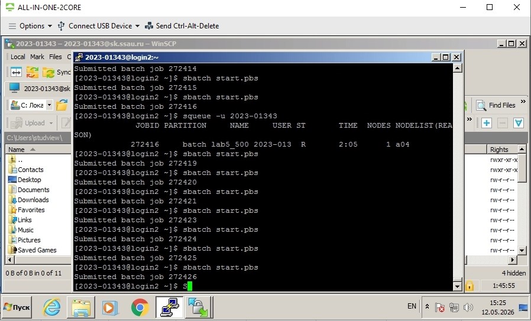
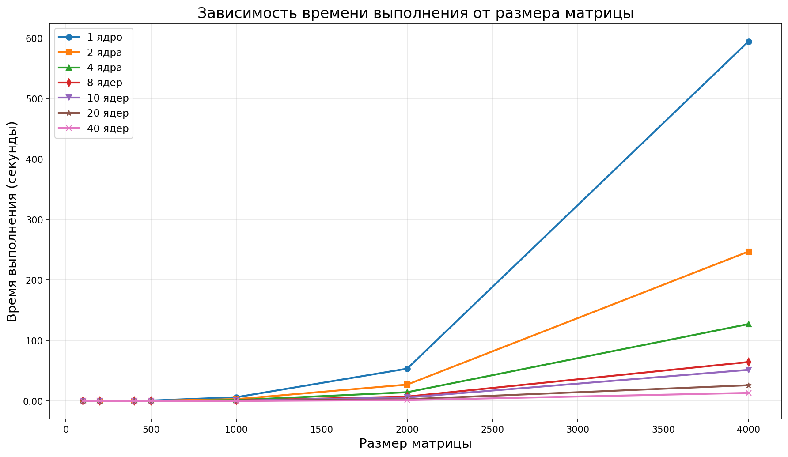

# Лабораторная работа №5

## 1. Цель работы

Параллельную версию программы на MPI необходимо также запустить на суперкомпьютере «Сергей Королёв».

---

## 2. Ход работы

В ходе лабораторной работы я запустил программу из 3 лабы на суперкомпьютере "Сергей Королёв"

Для начала я подключился к суперкомпьютеру при помощи PuTTy и при помощи WinSCP

## Работа в суперкомпьютере:

---
### Работа mpi.cpp:
Данная программа реализует параллельное умножение квадратных матриц с использованием MPI. Главный процесс генерирует две случайные матрицы A и B, после чего рассылает их всем процессам. Каждый процесс получает свою порцию строк матрицы A, умножает их на матрицу B и отправляет результат главному процессу, который собирает итоговую матрицу C, сохраняет её в файл и выводит время выполнения и производительность в GFLOPS.

## 3. Результаты тестирования

**Размеры матриц:** 100, 200, 400, 500, 1000, 2000, 4000

### Таблица результатов

| Ядра | 100 | 200 | 400 | 500 | 1000 | 2000 | 4000 |
|------|-----|-----|-----|-----|------|------|------|
| 1 | 0.02 | 0.06 | 0.41 | 0.81 | 6.42 | 53.59 | 594.67 |
| 2 | 0.01 | 0.04 | 0.21 | 0.41 | 3.22 | 27.21 | 247.24 |
| 4 | 0.01 | 0.03 | 0.11 | 0.21 | 1.61 | 14.59 | 127.33 |
| 8 | 0.00 | 0.02 | 0.06 | 0.11 | 0.86 | 7.42 | 64.55 |
| 10 | 0.00 | 0.01 | 0.05 | 0.09 | 0.69 | 5.97 | 51.64 |
| 20 | 0.00 | 0.01 | 0.03 | 0.05 | 0.38 | 3.04 | 26.17 |
| 40 | 0.00 | 0.00 | 0.02 | 0.03 | 0.20 | 1.55 | 13.51 |
### График зависимости времени от размера матрицы

---

### 4. Вывод по тестам

Анализ таблицы и графиков показывает, что при небольших объёмах данных использование многопоточности практически не влияет на время выполнения программы. Однако при увеличении размера матриц рост числа процессов приводит к заметному сокращению времени перемножения. Сравнение суперкомпьютера с моим ПК демонстрирует, что суперкомпьютер обеспечивает более эффективное перемножение матриц с использованием MPI.

---

### 5. Итоги

В ходе работы я научился работать с суперкомпьютером "Сергей Королев", компилировать и запускать на суперкомпьютере свои программы. Также удалось сравнить эффективность суперкомпьютера со своим компьютером
